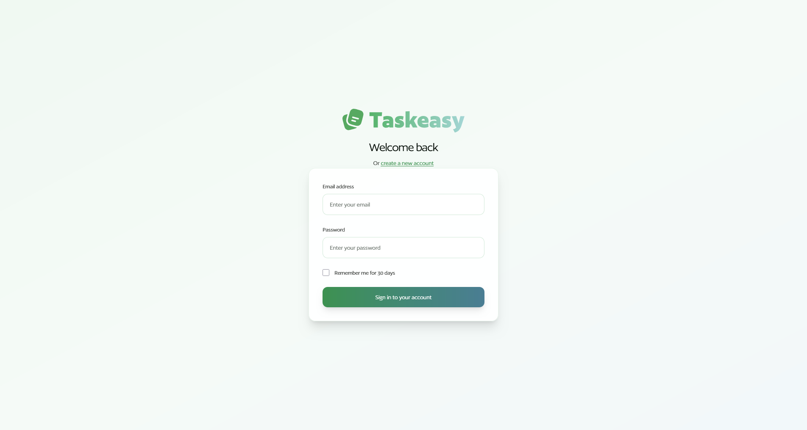
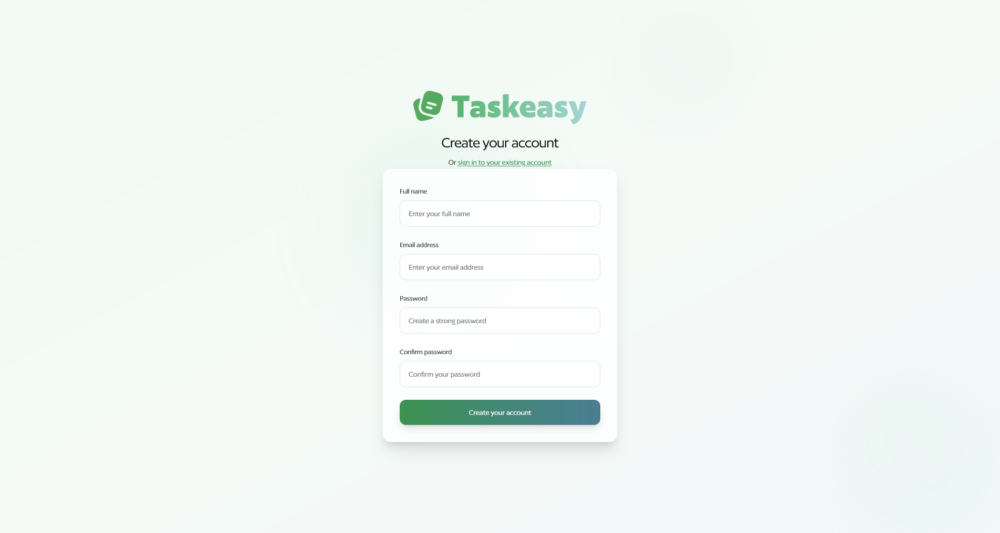
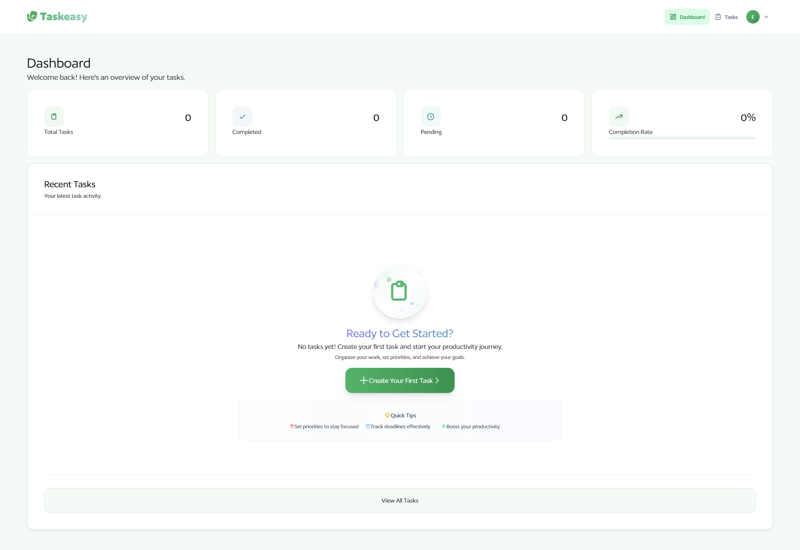
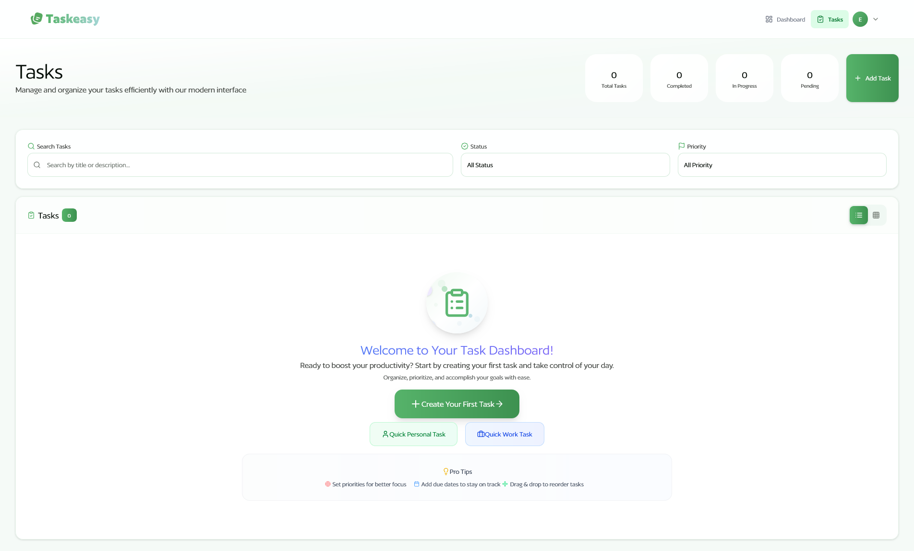
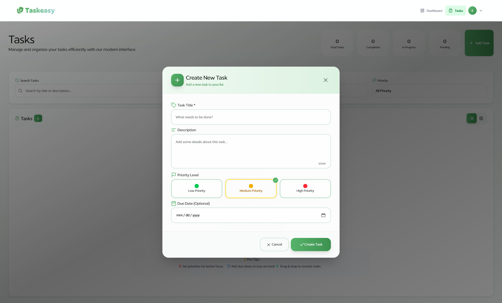
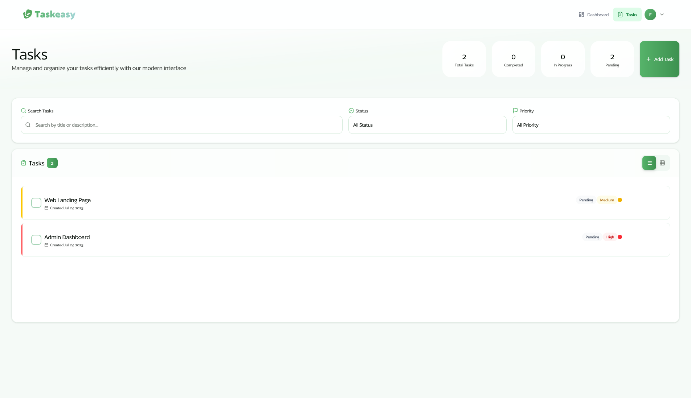
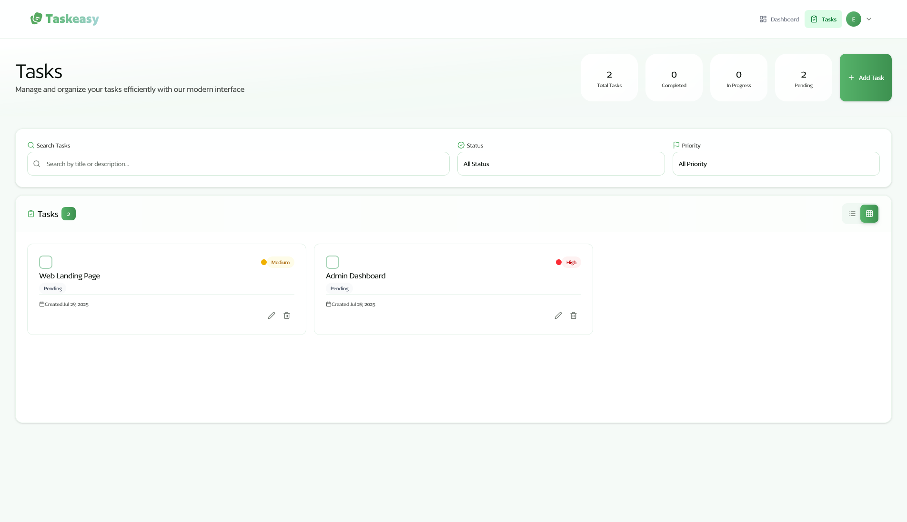
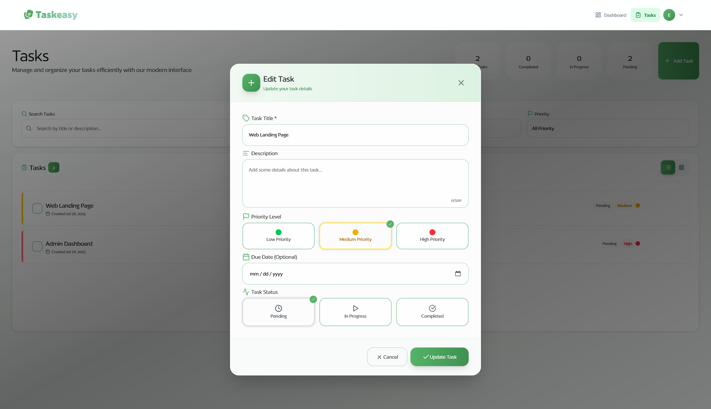
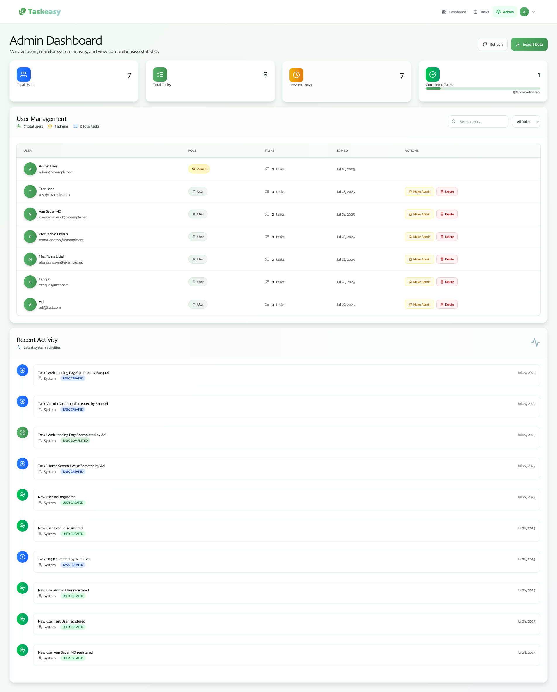
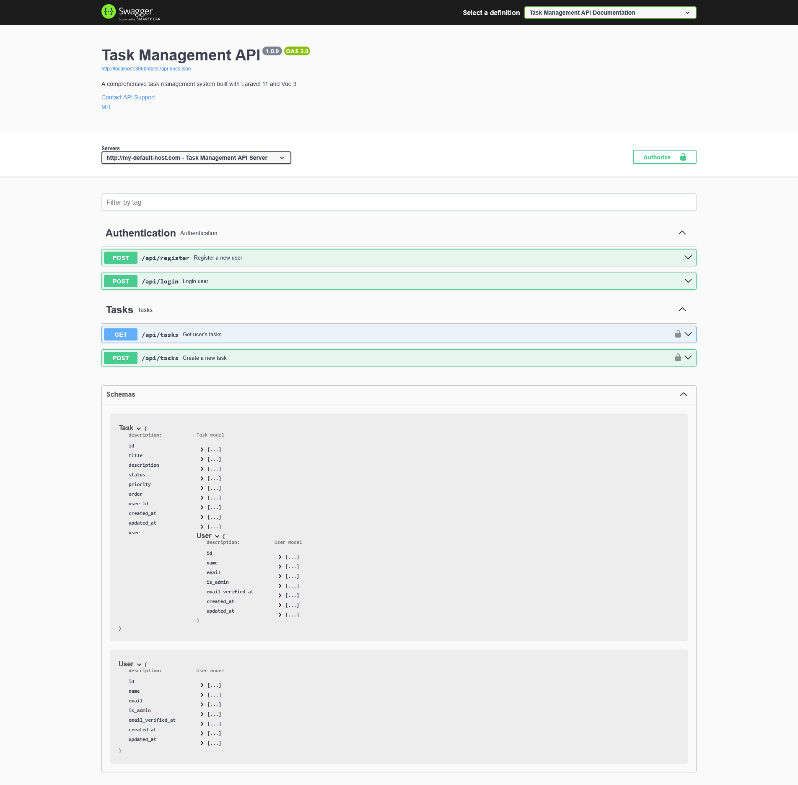

# 🎯 Task Management System - Showcase

> **A visual tour of our modern, full-stack task management application**

Welcome to the visual showcase of our Task Management System built with Laravel 11 and Vue 3. This gallery demonstrates the clean, modern interface and comprehensive functionality of our application.

---

## 🔐 **Authentication System**

### Login Page

_Clean, modern login interface with gradient backgrounds and smooth animations_

### Registration Page

_User-friendly registration form with real-time validation and beautiful design_

---

## 📋 **Task Management Interface**

### Dashboard - Empty State

_Engaging empty state design that guides new users with clear call-to-actions_

### Tasks - Empty State

_Beautiful empty state for the tasks view with contextual actions and helpful messaging_

### Create Task Modal

_Intuitive task creation modal with comprehensive form fields and modern UI elements_

### Tasks List View

_Clean, organized list view of tasks with drag-and-drop functionality and status indicators_

### Tasks Grid View

_Card-based grid layout for visual task management with priority and status badges_

### Edit Task Interface

_Comprehensive task editing with all task properties and user-friendly controls_

---

## 👨‍💼 **Admin Dashboard**

### Admin Panel

_Comprehensive admin dashboard with user management, statistics, and system monitoring_

---

## 📚 **API Documentation**

### Swagger API Documentation

_Complete, interactive API documentation with all endpoints and testing capabilities_

---

## ✨ **Key Features Demonstrated**

### 🎨 **Modern UI/UX Design**

- **Glassmorphism Effects** - Transparent cards with backdrop blur
- **Gradient Backgrounds** - Beautiful color transitions throughout the app
- **Smooth Animations** - Micro-interactions and loading states
- **Responsive Design** - Works perfectly on all device sizes
- **Empty States** - Engaging designs that guide user actions

### 🚀 **Advanced Functionality**

- **Drag & Drop** - Intuitive task reordering with visual feedback
- **Real-time Updates** - Live task synchronization across sessions
- **Modal Interfaces** - Clean, focused task creation and editing
- **Advanced Filtering** - Search, status, and priority filters
- **Admin Controls** - Comprehensive user and system management

### 🛡️ **Professional Features**

- **Secure Authentication** - Laravel Sanctum SPA authentication
- **Role-based Access** - Admin and user role management
- **API Documentation** - Complete Swagger/OpenAPI documentation
- **Form Validation** - Real-time client and server-side validation
- **Error Handling** - Graceful error states and user feedback

### 📱 **Responsive Experience**

- **Mobile-First Design** - Optimized for all screen sizes
- **Touch-Friendly** - Intuitive touch interactions
- **Fast Loading** - Optimized performance and caching
- **Cross-Browser** - Compatible with all modern browsers

---

## 🔧 **Technology Stack Highlights**

| Frontend                 | Backend                 | Tools               |
| ------------------------ | ----------------------- | ------------------- |
| Vue 3 (Composition API)  | Laravel 11              | Vite                |
| TailwindCSS              | MySQL 8+                | Swagger/OpenAPI     |
| Pinia (State Management) | Laravel Sanctum         | PHPUnit Testing     |
| Vue Router               | Redis (Caching)         | Git Version Control |
| Axios (HTTP Client)      | Composer (Dependencies) | VS Code             |

---
